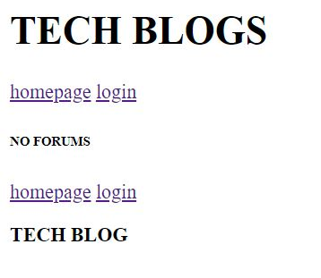

# Tech Blog

<!-- 
<a href="https://twitter.com/DonaldTrump"> -->
<!--  -->

## Installation

1. Download or Clone this repository.
2. **Node.js** and **MYSQL** are required.
3. `npm install` in terminal to install all required dependencies.

## Usage

* Make sure to run `npm run seed` to seed the database.
* Then use `npm run watch` to test the server using nodemon.
* In your browser to URL : `localhost:3001`.
* Routes to use: `http://localhost:3001/api/users`, `/api/forums`, `/api/comments`.
* You should see: 

* [Deployed Application]('')

## Features

* Javascript
* mySQL
* npm
* .env
* Heroku

## License

Copyright (c) BoiledLettuce. All rights reserved.